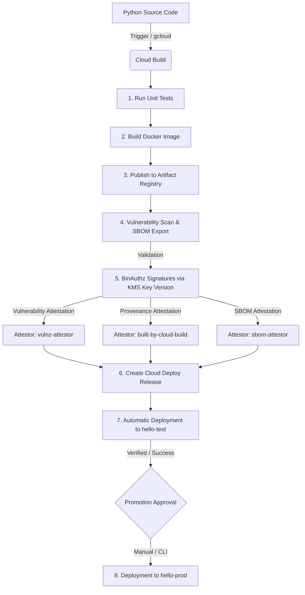

# Deployment Guide: GKE SLSA Demo

This document details the methods for deploying the application on the secure Google Kubernetes Engine (GKE) infrastructure using Binary Authorization and SLSA.

---

## 🏗️ CI/CD Pipeline Architecture

The following diagram illustrates the complete build, signing (BinAuthz attestations), and progressive deployment workflow:



---

## 🛠️ Method 1: Automatic Deployment (Git Tag)

The automatic trigger is configured via Cloud Build to intercept Git tags matching the `^v.*` pattern.

### Step 1: Update the application version
Modify the `app/.version` file to specify the new version:
```bash
echo "v1.0.15" > app/.version
```

### Step 2: Commit and push changes to Git
Add, commit, and push the modified file:
```bash
git add app/.version
git commit -m "chore: bump version to v1.0.15"
git push origin main
```

### Step 3: Create and push the Git tag
Create the Git tag matching the updated version and push it:
```bash
git tag v1.0.15
git push origin v1.0.15
```
*Pushing the tag will automatically trigger the Cloud Build `hello-app-trigger` pipeline.*

---

## 💻 Method 2: Manual Deployment (via `gcloud`)

If you want to force a local deployment or test without pushing a Git tag to GitHub, you can manually submit the build to Cloud Build using `gcloud`.

### Build Submission Command
Run the following command at the root of the project:

```bash
gcloud builds submit --config=app/cloudbuild.yaml \
  --substitutions=_KMS_KEY_NAME=projects/lcl-acdc-sbox-e3e1/locations/europe-west1/keyRings/binauthz/cryptoKeys/binauthz-signer/cryptoKeyVersions/1 \
  --service-account="projects/lcl-acdc-sbox-e3e1/serviceAccounts/clouddeploy-runner@lcl-acdc-sbox-e3e1.iam.gserviceaccount.com" \
  --project="lcl-acdc-sbox-e3e1" \
  --region="europe-west1"
```

### Parameter explanations:
* `--config`: Points to the build configuration file to use (`app/cloudbuild.yaml`).
* `_KMS_KEY_NAME`: Specifies the exact KMS key version resource path to sign the BinAuthz attestations.
* `--service-account`: Uses the dedicated `clouddeploy-runner` service account which has the necessary IAM permissions to sign, scan, push to Artifact Registry, and create the Cloud Deploy release.

---

## 🚀 Monitoring and Promoting Deployments

Once the build (automatic or manual) completes successfully, Cloud Deploy takes over.

### 1. Monitor the Deployment on Test
The deployment to the `hello-test` cluster is triggered automatically.

To view the list of rollouts for a release:
```bash
gcloud deploy rollouts list \
  --release="<RELEASE_ID>" \
  --delivery-pipeline="deploy-demo-pipeline" \
  --region="europe-west1" \
  --project="lcl-acdc-sbox-e3e1"
```

### 2. Promote to Production (`hello-prod`)
Deploying to production requires manual approval.

#### Step A: Promote the release to the prod target
```bash
gcloud deploy releases promote \
  --release="<RELEASE_ID>" \
  --delivery-pipeline="deploy-demo-pipeline" \
  --region="europe-west1" \
  --project="lcl-acdc-sbox-e3e1" \
  --quiet
```

#### Step B: Approve the rollout created for prod
```bash
gcloud deploy rollouts approve "<ROLLOUT_ID>" \
  --release="<RELEASE_ID>" \
  --delivery-pipeline="deploy-demo-pipeline" \
  --region="europe-west1" \
  --project="lcl-acdc-sbox-e3e1" \
  --quiet
```

---

## 🔍 GKE Deployment Verification

To verify that the application is running correctly on the respective clusters:

```bash
# Connect to the cluster (hello-test or hello-prod)
gcloud container clusters get-credentials hello-test --region=europe-west1 --project=lcl-acdc-sbox-e3e1

# List the running pods
kubectl get pods

# Get the LoadBalancer's external IP
kubectl get svc hello
```

Test the returned URL (port 8080) using an HTTP tool or in a browser:
```bash
curl -i http://<EXTERNAL_IP>:8080/
```
*(Should return an HTTP `200` status code with the response body `"Hello"`)*
