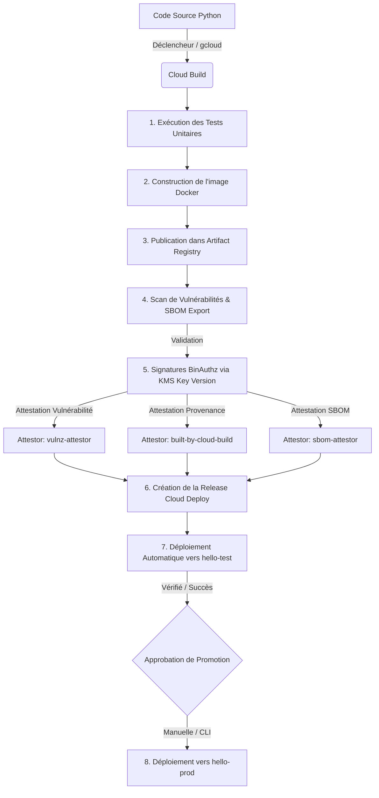

# Guide de Déploiement : GKE SLSA Demo

Ce document détaille les méthodes de déploiement de l'application sur l'infrastructure Google Kubernetes Engine (GKE) sécurisée via Binary Authorization et SLSA.

---

## 🏗️ Architecture du Pipeline CI/CD

Le diagramme suivant illustre le flux complet de construction, de signature (attestations BinAuthz) et de déploiement progressif :



---

## 🛠️ Méthode 1 : Déploiement Automatique (Git Tag)

Le déclencheur automatique est configuré via Cloud Build pour intercepter les tags Git correspondants au modèle `^v.*`.

### Étape 1 : Mettre à jour la version de l'application
Modifiez le fichier `app/.version` pour y indiquer la nouvelle version :
```bash
echo "v1.0.15" > app/.version
```

### Étape 2 : Commiter et pusher les modifications sur Git
Ajoutez, commitez et poussez le fichier modifié :
```bash
git add app/.version
git commit -m "chore: bump version to v1.0.15"
git push origin main
```

### Étape 3 : Créer et pusher le tag Git
Créez le tag Git correspondant à la version mise à jour et poussez-le :
```bash
git tag v1.0.15
git push origin v1.0.15
```
*Le push du tag va automatiquement déclencher le pipeline Cloud Build `hello-app-trigger`.*

---

## 💻 Méthode 2 : Déploiement Manuel (via `gcloud`)

Si vous souhaitez forcer un déploiement local ou tester sans pusher de tag Git sur GitHub, vous pouvez soumettre manuellement le build à Cloud Build via `gcloud`.

### Commande de Soumission de Build
Exécutez la commande suivante à la racine du projet :

```bash
gcloud builds submit --config=app/cloudbuild.yaml \
  --substitutions=_KMS_KEY_NAME=projects/lcl-acdc-sbox-e3e1/locations/europe-west1/keyRings/binauthz/cryptoKeys/binauthz-signer/cryptoKeyVersions/1 \
  --service-account="projects/lcl-acdc-sbox-e3e1/serviceAccounts/clouddeploy-runner@lcl-acdc-sbox-e3e1.iam.gserviceaccount.com" \
  --project="lcl-acdc-sbox-e3e1" \
  --region="europe-west1"
```

### Explications des paramètres :
* `--config` : Indique le fichier de configuration de build à utiliser (`app/cloudbuild.yaml`).
* `_KMS_KEY_NAME` : Spécifie la version exacte de la clé de signature KMS pour créer les attestations BinAuthz.
* `--service-account` : Utilise le compte de service dédié `clouddeploy-runner` disposant des rôles nécessaires pour signer, scanner, et pousser sur Artifact Registry ainsi que créer la release Cloud Deploy.

---

## 🚀 Suivi et Promotion du Déploiement

Une fois le build (automatique ou manuel) terminé avec succès, Cloud Deploy prend le relais.

### 1. Suivre le déploiement sur Test
L'étape de déploiement sur le cluster de test `hello-test` se fait automatiquement.

Pour voir la liste des rollouts d'une release :
```bash
gcloud deploy rollouts list \
  --release="<RELEASE_ID>" \
  --delivery-pipeline="deploy-demo-pipeline" \
  --region="europe-west1" \
  --project="lcl-acdc-sbox-e3e1"
```

### 2. Promouvoir en Production (`hello-prod`)
Le déploiement en production requiert une validation manuelle.

#### Étape A : Promouvoir la release vers le target de prod
```bash
gcloud deploy releases promote \
  --release="<RELEASE_ID>" \
  --delivery-pipeline="deploy-demo-pipeline" \
  --region="europe-west1" \
  --project="lcl-acdc-sbox-e3e1" \
  --quiet
```

#### Étape B : Approuver le rollout créé pour la prod
```bash
gcloud deploy rollouts approve "<ROLLOUT_ID>" \
  --release="<RELEASE_ID>" \
  --delivery-pipeline="deploy-demo-pipeline" \
  --region="europe-west1" \
  --project="lcl-acdc-sbox-e3e1" \
  --quiet
```

---

## 🔍 Vérification du Déploiement GKE

Pour vérifier que l'application tourne bien sur les clusters correspondants :

```bash
# Se connecter au cluster (hello-test ou hello-prod)
gcloud container clusters get-credentials hello-test --region=europe-west1 --project=lcl-acdc-sbox-e3e1

# Lister les pods en cours d'exécution
kubectl get pods

# Obtenir l'IP externe du LoadBalancer
kubectl get svc hello
```

Testez l'URL renvoyée (port 8080) avec un outil HTTP ou dans un navigateur :
```bash
curl -i http://<EXTERNAL_IP>:8080/
```
*(Devrait retourner un code de succès `200` et le contenu `"Hello"`)*
